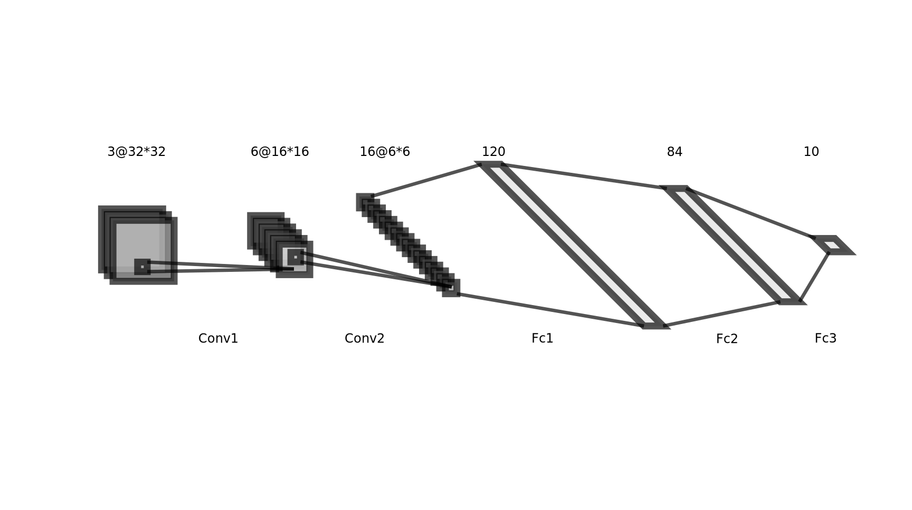
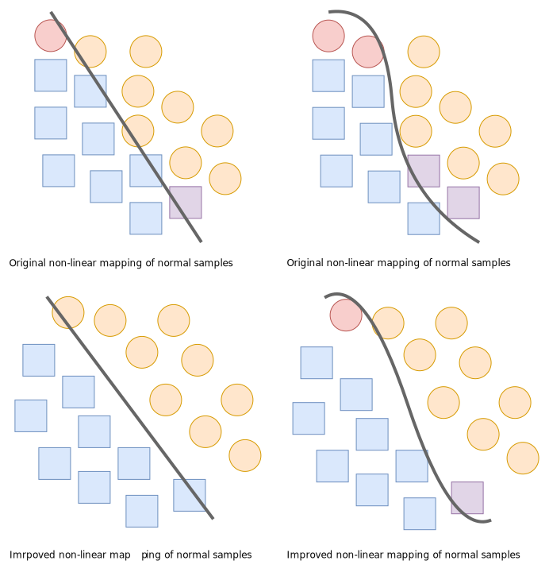
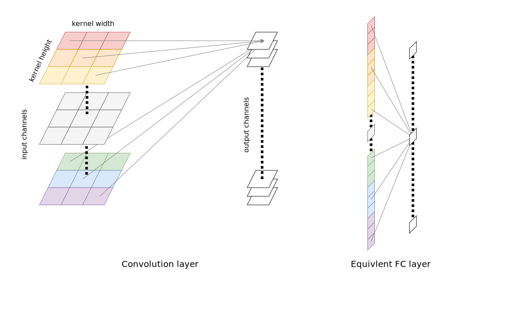
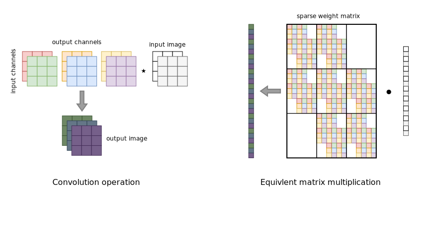
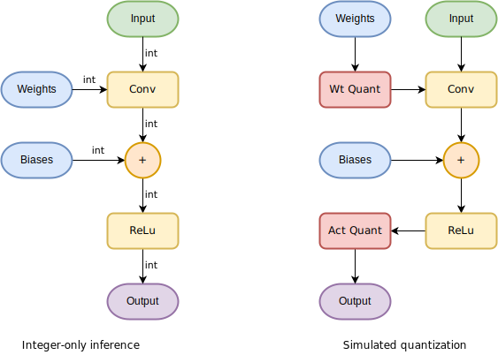
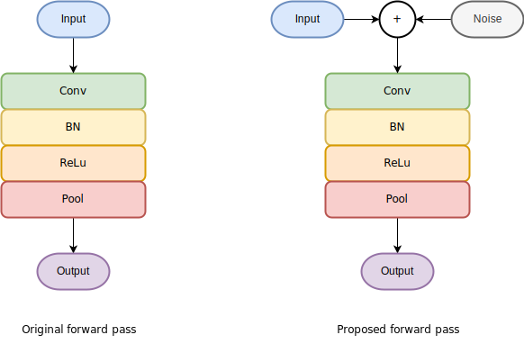

# Learning-Data-Science-with-Python Python 程序设计与数据科学导论

本项目为课程期中作业项目，仅供学习参考。详细内容参见[此文档](./doc/main.pdf)

## 部分内容

### 所用卷积网络架构

### 对抗攻击与防御原理

### 两种卷积层等效线性层方式

### 网络量化

### 随机自集成（Random Self-ensemble）

